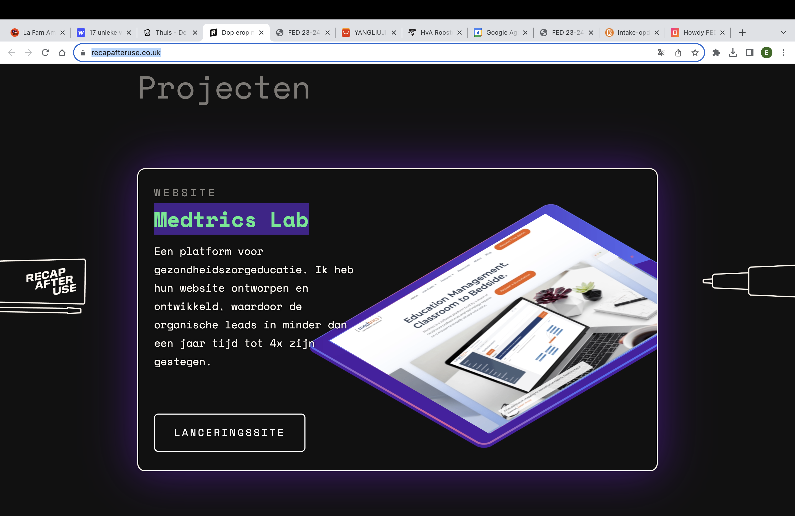
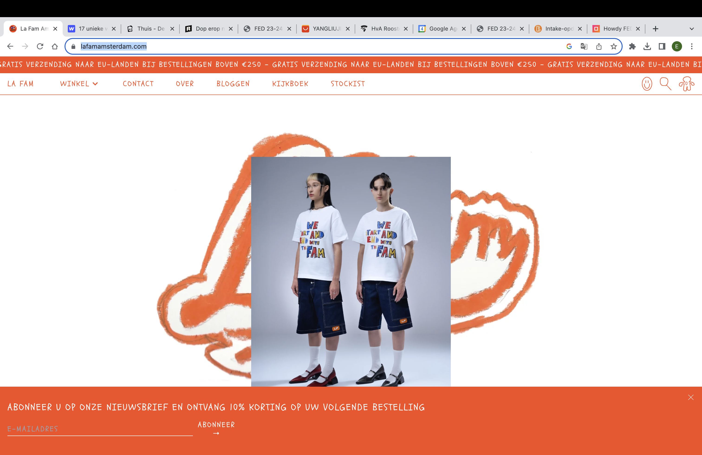
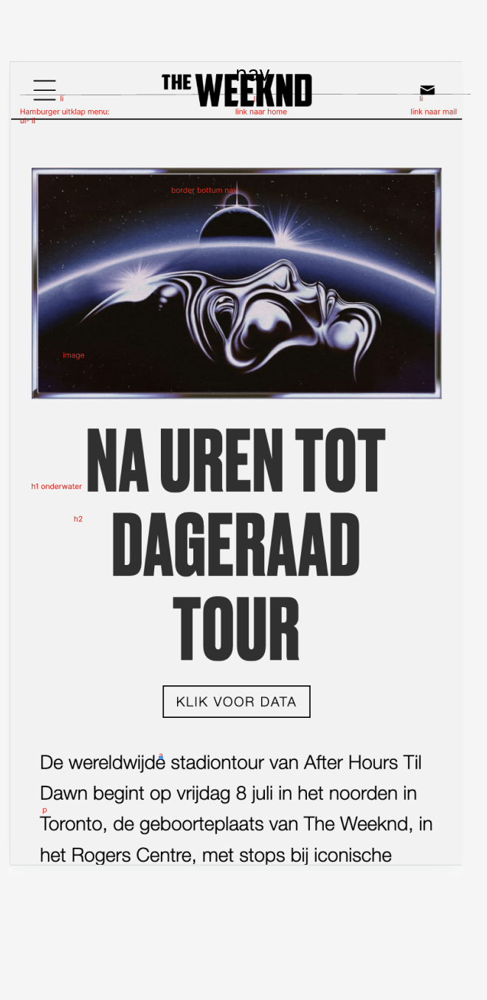
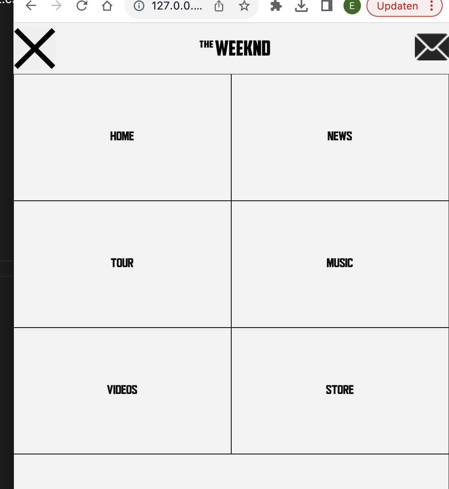
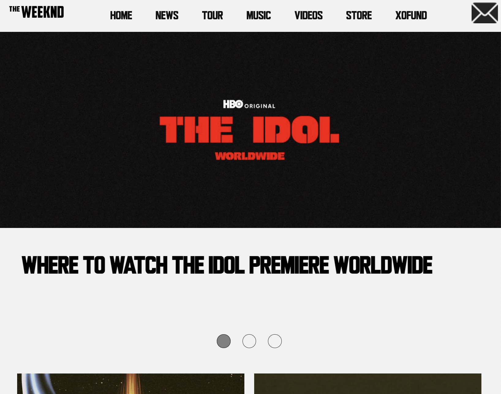

# Procesverslag
Markdown is een simpele manier om HTML te schrijven.  
Markdown cheat cheet: [Hulp bij het schrijven van Markdown](https://github.com/adam-p/markdown-here/wiki/Markdown-Cheatsheet).

Nb. De standaardstructuur en de spartaanse opmaak van de README.md zijn helemaal prima. Het gaat om de inhoud van je procesverslag. Besteedt de tijd voor pracht en praal aan je website.

Nb. Door *open* toe te voegen aan een *details* element kun je deze standaard open zetten. Fijn om dat steeds voor de relevante stuk(ken) te doen.

## Jij

  
uitwerken voor kick-off werkgroep

  ### Auteur:
  Esther Zoetelief 500905943

  #### Je startniveau:
  Rood

  #### Je focus:
  Surface plane (En responsive voor de extra punten)
 

## Je website

  
uitwerken voor kick-off werkgroep

  ### Je opdracht:
  link naar de website die je gaat namaken óf de naam/omschrijving van je eigen ontwerp
 Haalbaar: https://www.lafamamsterdam.com/
 Uitdagend:https://www.recapafteruse.co.uk/
 Lastig: https://the-goonies.webflow.io/

  #### Screenshot(s) van de eerste pagina (small screen): 
  hier de naam van de pagina  
  

  #### Screenshot(s) van de tweede pagina (small screen):
  hier de naam van de pagina  
  

   #### Screenshot(s) van de tweede pagina (small screen):
  hier de naam van de pagina  
  
 

## Toegankelijkheidstest 1/2 (week 1)

  
uitwerken na test in 2e werkgroep

  ### Bevindingen
  Lijst met je bevindingen die in de test naar voren kwamen:

  Uit mijn test kwam naar boven dat mijn website geen duidelijke opening heeft onderwater. Je begint met een h2 waar je niet een introductie krijgt.
  De volgorde van de kopjes kloppen wel. 
  Ook zijn er niet bij alle foto's alt gebruikt waardoor je minder informatie krijgt over de inthoud. 
  Daarnaast heb ik met behulp van een website gekeken wat voor fouten er naar boven kwamen. 

## Breakdownschets (week 1)

  
uitwerken na afloop 3e werkgroep

  ### de hele pagina: 
  

## Voortgang 1 (week 2)

  
uitwerken voor 1e voortgang

  ### Stand van zaken
Ik had veel moeite in het begin met het maken van de grids. Ook moest ik erg inkomen met het positioneren van elementen waarbij ze tegelijkertijd responsive waren. Ik vond het lastig om justify content enz te gebruiken. Ik heb toen veel opdrachten op dlo gemaakt en bijv de spelletjes: grid garden en display flex froggy. 

  ### Verslag van meeting
  hier na afloop snel de uitkomsten van de meeting vastleggen

  - grid beter begrijpen
  - begrijpen wat span betekent en hoe je dit kan toepassen
  - eerst alles goed in de telefoon formaat blijven uitwerken en dan pas responsive
  - goed oefenen met dispaly flex en zo min mogelijk posistion absolute gebruiken.

## Voortgang 2 (week 3)

  
uitwerken voor 2e voortgang

  ### Stand van zaken
Ik ben begonnen met het uitwerken van mijn hamburger menu. Omdat ik van een klasgenootje een tutorial kreeg dacht ik dta het makkelijk was om die op te volgen. Omdat ik de tutorial veel div's en classes gebruikt werden vond ik het lastig om op een semantische manier het allemaal te blijven begrijpen. uiteindelijk lukte dit ook niet dus. 
Daarna ben ik op websites zoals: mdm en w3schools gaan zoeken maar vond ik ingewikkelde codes. toen ben ik zelf gaan nadenken en bedacht ik dat ik misschien gwn de pagina moest gaan uitwerken en dan ontzichtbaar moet maken of van het scherm af moet schuiven. Dit werkte en is me uiteindelijk naar 2 dagen dus ook gelukt. ik ben hier erg blij mee. 
Ook ben ik begonnen met mijn tweede pagina. Ik heb de slider een soort van gemaakt maar hij gaat nog niet als hoe ik het wil. 

  ### Verslag van meeting
  hier na afloop snel de uitkomsten van de meeting vastleggen

  -snap slider leren hoe dat werkt
  -beter responsive voor hele kleine of hele grote schermen
  -de tekst niet capslock in html zetten maar upercase in css gebruiken
- ...

## Toegankelijkheidstest 2/2 (week 4)

  
uitwerken na test in 9e werkgroep

  ### Bevindingen
  Lijst met je bevindingen die in de test naar voren kwamen (geef ook aan wat er verbeterd is):
  - ik moet meer speciafieke alt gebruiken in mijn website
  - ik heb goed een input bij een label geplaatst zodat het duidelijker en overzichtelijker is 
  - ik heb een unieke namen gebruikt voor mijn pagina's en mijn classes die begrijpbaar zijn.
  -mijn ul stond eerst niet goed in de nav die heb ik nu goed in de nav geplaatst.
- ik ben er achter gekomen dat ik niet weet of mijn video's op pauze kunnen maar omdat het een iframe is denk ik dat dat automatisch gebeurt. 

## Voortgang 3 (week 4)

  
uitwerken voor 3e voortgang

  ### Stand van zaken
Ik heb deze week heel veel geknald en veel extra dingen toegevoegd. Allereerst heb ik het grid gemaakt van de tweede pagina. Dit ging erg makkelijk en snel. Toen ging ik proberen om een bijpassende dot te maken voor de slider. Dit verliep erg moeizaam, maar met wat hulp van de studentassistent is het mij gelukt en werkt dat nu. toen ging ik proberen alles responsive te maken en ging ik media querys toepassen. Ik vond het in het begin erg ingewikkeld hoe zoiets nou precies in elkaar zit maar uiteindelijk was het mij gelukt en ben ik er erg tevreden over. 
Ik had het meeste moeite met de nav omdat ik niet begreep hoe ik de css kon overschrijven omdat het hamburger menu er natuurlijk zo anders uitziet. uiteindelijk heb ik met veel inspecteren gezien dat het lag aan de regel: top: 4em; die ik nog had neergezet. De postion aboslute had ik immers al weggehaald. 

Ook heb ik een kruis toegevoegd bij de nav als je er op klikt. Dit is dan ook gelijk mijn micro animatie. Ik vond dit eerst heel lastig omdat het niet lukte. toen kwam ik er later achter dat ik gewoon het verkeerde plaatje aanvraagde. 

Waar ik het allerlangste mee bezig ben geweeest is de foto show op de eerste pagina. Ik ben hier zon 2 dagen bezig mee geweest en heb voor mijn gevoel alles geprobeerd. Ik had eerst met de student assistent besproken hoe ik dit zou aanpakken. In mijn hoofd leek het dus heel makkelijk. Maar omdat ik nog niet zo veel ervaring heb met JS wist ik niet hoe ik dit moest opschrijven en met elkaar moest koppelen. Dit was dus een groot drama. Ik heb hiervoor eerst heel veel Chatgbt gebruikt . Dit werkte helaas voor geen enkele meter. Nadat ik natuurlijk alle internet tutorials heb geprobeerd heb ik maar een vriend als hulplijn ingeschakeld die nog wel een ideetje had. Ik heb alles zelf opgeschreven het enige waarmee hij mij heeft geholpen is het aangeven waar de " & {} & [] moesten staan. 

Als allerlaatste wil ik zeggen dat er iets mis gaat met het uploden van mijn bestand in github. Het toont namelijk niet alleen sommige foto's niet. Ook stukken tekst worden niet laten zien. Ik heb het gevoel alsof het een oude versie is maar dat kan niet. ik heb het wel op filezilla goed geupload waar alles wel goed staat. zo kan ik toch nog een beetje aantonen dat ik iets opbenbaar kan plaatsen.

  ### Verslag van meeting
  hier na afloop snel de uitkomsten van de meeting vastleggen

-eerder uploaden op github
-meer inlezen over de haakjes van js
-meer errors weghalen

## Eindgesprek (week 5)

  
uitwerken voor eindgesprek

  ### Dit ging goed/Heb ik geleerd: 
  Ik ben erg trots op mijn stukken waar ik JS heb toegepast. Dit is omdat het heel veel werk kosten en ik het heel leuk vind dat het nu toch werkt. 

  
   
    

  ### Dit was lastig/Is niet gelukt:
  Korte omschrijving met plaatjes
Het is niet gelukt om mijn bestand goed up te loaden in github. Ook is het mij niet gelukt om extra animaties of easter eggs toe te voegen.
  

## Bronnenlijst

  
continu bijhouden terwijl je werkt

  Nb. Wees specifiek ('css-tricks' als bron is bijv. niet specifiek genoeg). 
  Nb. ChatGpT en andere AI horen er ook bij.
  Nb. Vermeld de bronnen ook in je code.

  1.chat gbt
  2. https://developer.mozilla.org/en-US/docs/Web/CSS/repeat
  3. https://developer.mozilla.org/en-US/docs/Web/API/window/requestAnimationFrame
  https://www.w3schools.com/howto/howto_js_topnav_responsive.asp

